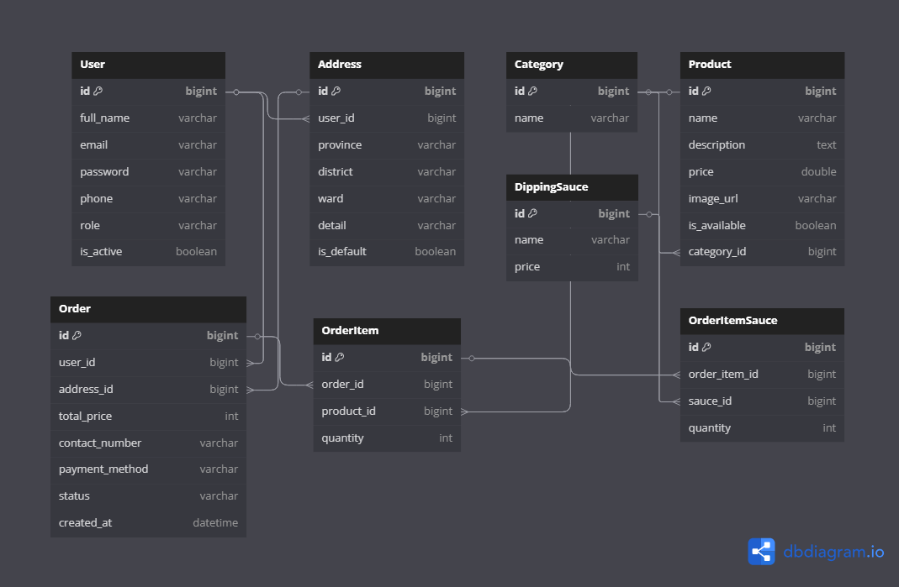

# Food Store Backend

A RESTful backend API for a food ordering platform, built using **Spring Boot**. Users can browse products, place orders with customizable sauces, manage delivery addresses, and more.

---

## Features

-  User authentication & JWT authorization
-  Product and category management
-  Dipping sauce selection per item
-  Order placement with multi-sauce support
-  PDF order receipt generation
-  Image upload via Cloudinary
-  Email notifications with Spring Mail
-  Multiple addresses per user
-  Role-based access (Admin/User)
-  Unit + Integration testing with JUnit & Mockito

---
## Entity Relationship Diagram (ERD)



**Key relationships:**

- `User` → (1:N) → `Order`
- `Order` → (1:N) → `OrderItem`
- `OrderItem` → (N:M) → `DippingSauce` (via `OrderItemSauce`)
- `Product` → (N:1) → `Category`
- `User` → (1:N) → `Address`

---
## Tech Stack

- **Java 17**
- **Spring Boot 3**
- **Spring Security + JWT (jjwt)**
- **Spring Data JPA + MySQL**
- **Cloudinary API** (image uploads)
- **iText + PDFBox** (PDF generation)
- **Spring Mail** (emailing)
- **Lombok, Gson, Guava**
- **JUnit 5 + Mockito** (testing)

---
## Getting Started

### 1. Clone the repository

### 📦 Requirements

- Java 17+
- Maven
- MySQL installed locally

### 🛠️ Run Locally

```bash
git clone https://github.com/Karot1712/Food-Store.git
cd Food-Store
./mvnw spring-boot:run
```
---
## Configuration
Edit src/main/resources/application.properties:
```properties
# App Info
server.port=5051

# Database Config
spring.datasource.url=jdbc:mysql://localhost:3306/food_store
spring.datasource.driver-class-name=com.mysql.cj.jdbc.Driver
spring.datasource.username=your_db_username
spring.datasource.password=your_db_password

# Hibernate Config
spring.jpa.hibernate.ddl-auto=update
spring.jpa.properties.hibernate.dialect=org.hibernate.dialect.MySQLDialect
spring.jpa.properties.hibernate.format_sql=true

# JWT
secretJwtString=your_jwt_secret_key

# Mail Config
spring.mail.host=smtp.gmail.com
spring.mail.port=587
spring.mail.username=your_email
spring.mail.password=your_app_password
spring.mail.properties.mail.smtp.auth=true
spring.mail.properties.mail.smtp.starttls.enable=true

# Cloudinary Config
cloudinary.cloud-name=your_cloud_name
cloudinary.api-key=your_api_key
cloudinary.api-secret=your_api_secret

# File Upload
spring.servlet.multipart.max-file-size=50MB
spring.servlet.multipart.max-request-size=50MB
```
## Sample API Request (Place Order)
```json
{
  "totalPrice": 90000,
  "contactNumber": "0901234567",
  "paymentMethod": "COD",
  "address": {
    "street": "123 Nguyễn Huệ",
    "city": "Hồ Chí Minh"
  },
  "itemRequests": [
    {
      "productId": 1,
      "quantity": 2,
      "sauces": [
        {
          "sauceId": 1,
          "quantity": 2
        }
      ]
    }
  ]
}
```
## Project Structure
```bash
├── controller/         # API endpoints
├── service/            # Business logic layer
├── repository/         # JPA interfaces
├── model/              # Entity classes
├── dto/                # Data Transfer Objects
├── config/             # Security & JWT configuration
├── utils/              # PDF generation, Cloudinary upload
├── docs/               # ERD & documentation
└── application.properties
```

